# Medical Coding Pipeline — Design & Plan

> **AppliedAI · Opus AI Engineer — Exercise 2**
> An offline pipeline that reads unstructured clinical notes and produces
> **auditable, reviewer-ready** ICD-10 diagnosis + CPT procedure suggestions —
> each with a confidence score, supporting evidence, and warnings.
>
> **Design thesis:** *The LLM is a constrained reasoning component inside a
> deterministic, observable pipeline — not the pipeline itself.* We turn a
> stochastic model into an auditable system by **constraining it with retrieval**
> (it can only choose real codes), **verifying it with an independent auditor
> agent**, and **bounding it with deterministic coding rules**.

---

## 0. How to read this document

This is the **design** deliverable. The implementation is a ~1-day build that
follows it. Sections 2–4 establish *what* the brief asks and *what we assume*;
sections 6–13 are the architecture (heavy on diagrams); sections 14–19 cover
evaluation, decisions, limits, and build plan. The 1–2 page PDF is a distillation
of §6, §8, §9.3, §16, §17.

---

## 1. Problem & goals

Medical organizations translate narrative clinical notes into standardized codes
(ICD-10 for diagnoses, CPT for procedures) for billing, reporting, and records.
Accuracy and auditability are paramount. The system must **suggest** codes for a
**human reviewer** to validate or override — it is *supervised automation*, not
autonomous coding. This is the correct framing: even SOTA full-vocabulary coding
tops out around **micro-F1 ≈ 0.54** (RAG-Coding, 2026), so a human-in-the-loop
review gate is a necessity, not a fallback.

---

## 2. Requirement traceability matrix

Every Problem.md requirement, mapped to where this design satisfies it.

| #      | Problem.md requirement                                                                                  | Where / how satisfied                                                                                                                                   |
| ------ | ------------------------------------------------------------------------------------------------------- | ------------------------------------------------------------------------------------------------------------------------------------------------------- |
| O1     | ICD-10 diagnosis codes**with confidence**                                                         | Coder + Auditor agents over real ~75k ICD-10 catalog →`CodeSuggestion` with **blended, calibrated** confidence (§8, §9.7)                    |
| O2     | CPT procedure codes**with confidence**                                                            | Same path over synthetic CPT-shaped catalog (§4, §8)                                                                                                  |
| O3     | **Evidence references** per code                                                                  | `ExtractedFact` verbatim span + char offsets attached to every `CodeSuggestion` (§9.2, §10)                                                       |
| O4     | **Warnings**: missing info / ambiguity / conflict                                                 | Deterministic rule engine + LLM auditor → typed `Warning[]` (§9.6)                                                                                  |
| O5     | **Structured payload** for human review + override                                                | `CodingResult` (Pydantic-validated) + reviewer-override fields + lifecycle (§10, §11)                                                               |
| C1     | Large code space (tens of thousands)                                                                    | **Retrieve-then-constrain**: hybrid search over the full ~75k ICD-10 set narrows to a top-K whitelist per fact (§9.3)                            |
| C2     | LLM for extraction**and reasoning**                                                               | Three role-specialized agents (extraction, coder, auditor) via LiteLLM (§8)                                                                            |
| C3     | **Structured, auditable, reproducible**                                                           | Enforced structured output → Pydantic;`RunMetadata` + `trace_id` audit log; temp=0 + pinned dated model snapshots + versioned prompts (§12, §13) |
| D1     | Ingests raw notes                                                                                       | Ingestion stage (§9.1)                                                                                                                                 |
| D2     | Extracts medical facts/signals                                                                          | Extraction agent + assertion status (§9.2)                                                                                                             |
| D3     | Candidate dx + px codes                                                                                 | Hybrid retrieval (§9.3)                                                                                                                                |
| D4     | Confidence + supporting evidence                                                                        | Confidence model (§9.7) + evidence binding (§9.2)                                                                                                     |
| D5     | Reviewer-ready result                                                                                   | `CodingResult` JSON (§10)                                                                                                                            |
| R1     | Local**or** container                                                                             | Typer CLI + Docker (py3.11) (§15)                                                                                                                      |
| R2     | Demonstrates ingestion→processing→output                                                              | End-to-end pipeline (§6, §7)                                                                                                                          |
| R3     | Structured, validated results                                                                           | Pydantic models everywhere (§10)                                                                                                                       |
| R4     | Logging/tracing for audit                                                                               | Structured JSON logs keyed by `trace_id` + per-stage metrics (§13)                                                                                   |
| P1–P5 | PDF: architecture/flow, retrieval strategy, LLM/prompting, decisions/trade-offs, limitations/extensions | §6/§7, §9.3, §8, §16, §17                                                                                                                         |

---

## 2.1 "Minimal but complete" — what is core vs. enhancement

The brief demands a *minimal but complete* implementation. We draw the line
explicitly so nothing required is missing and nothing is over-built.

**Minimal-complete core — this alone satisfies every row of §2:**
ingest (multi-page) → extract facts (evidence span + negation/status) → hybrid
retrieve candidate whitelist → **coder agent** (pick from whitelist + confidence +
rationale) → deterministic rule checks (typed warnings) → Pydantic `CodingResult`
+ override fields → structured `trace_id` logging → CLI + Docker → real ICD-10 +
synthetic CPT + authored notes → design PDF.

**Enhancements layered on top — justified; each cheap or toggleable; none needed for completeness:**

| Enhancement | Why it's here | Kept minimal by |
| --- | --- | --- |
| **Auditor / verifier agent** (the "heart") | accuracy + ambiguity/conflict warnings; mirrors real coder→QA; core JD signal | default-on but `--no-verify`; selective + batched; **core is complete without it** |
| Multi-LLM (independent verifier model) | cuts correlated errors | one config line; same-model fallback |
| `make eval` (micro-F1, recall@k, hierarchical) | brief stresses "high accuracy" | tiny authored gold set |
| Prompt-consistency test | reproducibility / "consistency" (JD) | one small test |
| Rich metrics (tokens / cost / latency) | observability (JD); basic trace is core | captured via LiteLLM, ~free |
| retry / cache / graceful degradation | reliability | thin wrappers |

**Explicitly out of minimal scope** (named as extensions, not built): FastAPI,
docker-compose, reviewer UI, full ICD tabular / NCCI rule graph, **formal
confidence calibration** (isotonic/Platt — needs a larger gold set),
Grafana/Langfuse, batch mode.

---

## 3. Assumptions (explicit — directly answers the "formulate assumptions" criterion)

1. **No dataset was provided**, so we source data ourselves, *real where legally
   free, synthetic where restricted/private* (§4).
2. Clinical notes are **authored synthetic** and de-identified — **no PHI, no DUA**.
3. **ICD-10-CM FY2026** (US public domain, CDC/NCHS) is bundled; codes are real.
4. **CPT is AMA-copyrighted** and **cannot be redistributed** (verified: no free
   tier; descriptors + the code-set compilation are protected). We ship a
   **synthetic CPT-shaped** catalog; a licensed CPT file drops in via config.
5. **Confidence is a guidance signal, not a calibrated clinical probability** —
   it is empirically calibrated on our gold set and shown as tiers, not raw %.
6. The default embedder (`all-MiniLM-L6-v2`) is a **demo compromise**; a
   biomedical embedder (SapBERT/PubMedBERT) is the production choice.
7. **Encounter type (inpatient vs outpatient)** is a first-class input — it
   changes the "uncertain diagnosis" coding rule entirely (§9.6).
8. This is **supervised automation**: the system suggests; a human decides.
9. Eval numbers are **illustrative on a small authored gold set**, not a benchmark.

---

## 4. Data strategy

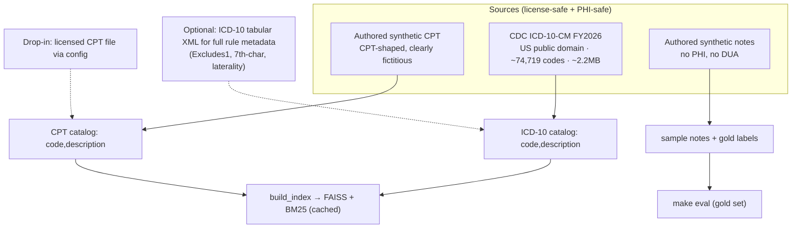

- **Why real ICD-10:** the brief's core challenge is the *large code space*. Using
  the real ~75k catalog makes retrieval genuinely hard and reviewer-verifiable
  (`E11.9` really must come back for "type 2 diabetes"). Synthesizing it would
  dodge the one thing the exercise most tests.
- **Why synthetic CPT:** AMA licensing forbids bundling. The only *free real*
  procedure set (HCPCS Level II) is the wrong domain (supplies/drugs/DME, not
  physician procedures), so it would demo *worse*. Synthetic CPT-shaped codes
  match note procedures, stay legal, and the architecture is drop-in for real CPT.
- **Why synthetic notes:** every public corpus (MIMIC, n2c2, MTSamples) forbids
  redistribution or carries PHI/DUA constraints. Authoring our own is the clean
  path and lets us deliberately exercise multi-page, negation, ambiguity, and
  conflict cases (which also become the eval gold set).

Each datum is one simple row: `code, description` (+ system). The description is
the semantic content we embed and search; the code is the output label.

---

## 5. Evidence base (research that shaped this design)

This design is grounded in current literature (full citations in §20). Load-bearing findings:

- **Direct LLM code generation fails** — across GPT-4/3.5/Gemini/Llama2, **<50%
  exact match**; up to **35% non-billable/hallucinated** ICD-10 codes. → never let
  the LLM free-generate a code. *(NEJM AI 2024)*
- **Retrieve-then-rerank wins** — constraining the LLM to retrieved candidates
  turned 6% → ~100% on a constrained linking task; it reframes a 75k-way
  generation problem as a k-way selection. *(arXiv 2407.12849; CLH, EMNLP 2025)*
- **Coder + Auditor decomposition gives the best precision/recall** on MIMIC-IV,
  beating both draft-only and LLM-only. *(MDPI Informatics 2026)*
- **Verifier must be externally grounded** — LLMs *cannot* reliably self-correct
  on intrinsic feedback (the bottleneck is error *detection*). Ground the auditor
  in the code ontology + evidence spans. *(Huang et al., ICLR 2024; CoVe)*
- **Heterogeneous (different-model) verification** reduces correlated errors and
  self-preference bias. *(self-preference 2410.21819; A-HMAD 2025)*
- **Don't over-decompose** — multi-agent gains are often minimal and ~75% of
  failures are "silent gray errors"; only add an agent with a clear contract +
  external check. *(MAST, NeurIPS 2025)* → our 3 agents are the *good* kind.
- **Assertion/negation handling is mandatory** — coding denied/suspected/family/
  historical findings as active is the top false-positive source. *(2503.17425)*
- **Reason-then-format** — strict JSON constraints degrade reasoning; reason in
  free text, then emit structured output, then validate→repair. *(2408.02442)*
- **Confidence: blend + calibrate** — raw verbalized confidence is overconfident
  (ECE ~0.1); blend retrieval + verifier-agreement (+ optional self-consistency)
  and calibrate on gold. *(Xiong et al. 2306.13063; Tian et al. 2305.14975)*
- **recall@k is the ceiling** — if the gold code isn't in the retrieved shortlist,
  nothing downstream can recover it; report it as a first-class metric. *(JBI 2023)*

---

### 6. High-level architecture (main diagram)

```mermaid
flowchart TB
    A["Clinical note (.txt)"] --> ING

    subgraph ING["1 · Ingestion — deterministic"]
        ING1["Normalize · detect encounter type"] --> ING2["Segment SOAP · window long notes"] --> ING3["Global char-offset map"]
    end
    ING --> EXT

    subgraph EXT["2 · Extraction Agent — LLM"]
        EXT1["Extract dx / px / symptoms"] --> EXT2["Assertion status · normalized_term · evidence span"]
    end
    EXT --> RET

    subgraph RET["3 · Retrieval — deterministic"]
        RET1["Dense FAISS + Lexical BM25"] --> RET2["RRF fuse → top-K candidate WHITELIST"]
    end
    RET --> COD

    subgraph COD["4 · Coder Agent — LLM-A"]
        COD1["Select code(s) from whitelist ONLY"] --> COD2["Rationale + verbalized confidence"]
    end
    COD --> AUD

    subgraph AUD["5 · Auditor Agent — LLM-B (independent)"]
        AUD1["Evidence supports code? specificity? exclusions?"] --> AUD2["Agree → ok · Disagree → warn + downweight"]
    end
    AUD --> RUL

    subgraph RUL["6 · Rule Engine — deterministic symbolic"]
        RUL1["Excludes1 · 7th-char · laterality · combo · sequencing · dx↔px"] --> RUL2["Typed warnings"]
    end
    RUL --> ASM

    subgraph ASM["7 · Confidence + Assembly — deterministic"]
        ASM1["Blend → calibrate → 3-tier"] --> ASM2["Build CodingResult + RunMetadata"]
    end
    ASM --> OUT["Reviewer-ready JSON payload"]

    LLMGW["LiteLLM gateway · multi-provider · structured output · mock for tests"] -.-> EXT
    LLMGW -.-> COD
    LLMGW -.-> AUD
    CAT["Catalogs · ICD-10 real ~75k · CPT synthetic"] -.-> RET
    OBS["Observability · trace_id · latency · tokens · cost"] -.-> ASM
```

**Symbolic guardrails on both sides of the LLM:** retrieval is a *pre-constraint*
(the model may only pick from real, retrieved codes) and the rule engine is a
*post-constraint* (deterministic coding rules flag anything that violates the
ICD-10 guidelines). This is the literal *"symbolic product-logic integration into
language systems"* the role calls for.

---

## 7. End-to-end sequence

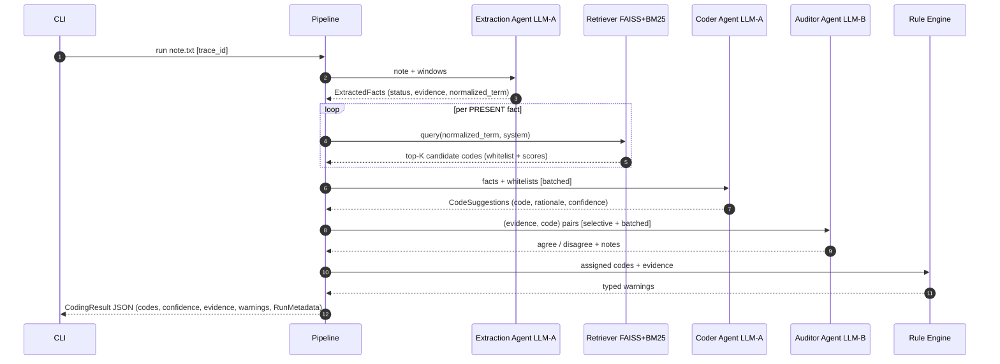

---

## 8. The core: a bounded multi-agent, multi-LLM "coding brain"

This is the heart of the design and the part the role is really evaluating.

### 8.1 Why agents + a verifier — and why *not* a swarm

Real medical coding is already a **multi-role human workflow**: a **coder**
assigns codes, and a separate **QA auditor** (a distinct credential — AAPC CPMA)
independently reviews them; upstream, **CDI** checks documentation and issues
**provider queries** when it's ambiguous. We mirror this with software agents —
which is exactly the decomposition the literature shows works best (coder+auditor,
MDPI 2026; the NHS-style Analyze→Locate→Assign→Verify agents of CLH, EMNLP 2025).

We deliberately keep it to **three narrow, externally-grounded agents** plus
deterministic glue. MAST (NeurIPS 2025) shows speculative multi-agent swarms add
latency and "silent gray errors" without reliable accuracy gains — agents help
*only* when each has a clear contract and an external check. Ours do.

### 8.2 Agent roster + multi-LLM mapping (via LiteLLM)

| Agent                | Human analog    | Input → Output                                                      | Grounding / constraint                                                   | Model                                                          |
| -------------------- | --------------- | -------------------------------------------------------------------- | ------------------------------------------------------------------------ | -------------------------------------------------------------- |
| **Extraction** | clinical scribe | note →`ExtractedFact[]` (term, status, evidence)                  | reason-then-format; assertion classifier; NegEx/ConText backstop         | `LLM_MODEL` (A)                                              |
| **Coder**      | medical coder   | fact +**candidate whitelist** → code + rationale + confidence | may only choose from retrieved real codes                                | (A)                                                            |
| **Auditor**    | QA auditor      | (evidence, code) → agree/disagree + note                            | checks vs cited evidence + code description + tabular rules (CoVe-style) | **`VERIFIER_MODEL` (B) — different model by default** |

Multi-LLM is trivial with **LiteLLM**: each agent reads a model string from
config. The **auditor defaults to a *different* model** to reduce correlated
errors and self-preference bias (evidence: §5). Same-model fallback is supported
but flagged as weaker.

### 8.3 Coder + Auditor deep dive

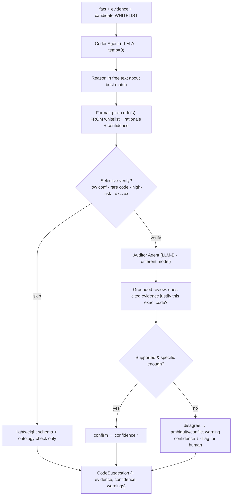

**Cost/latency discipline (so this stays "reasonably fast"):**

- **Selective verification** — only low-confidence / rare / high-risk / dx↔px
  codes go to the heavy auditor; high-agreement common codes pass a lightweight
  check. (Triage is the evidence-backed way to keep verification affordable.)
- **Batched calls** — extract once for the whole note; code all facts in one
  call; audit multiple pairs in one call.
- **Deterministic single-pass by default** (temp=0) rather than N-sample voting,
  because reproducibility (an explicit requirement) beats marginal accuracy from
  sampling. Self-consistency is available as an *optional* confidence signal.

---

## 9. Component deep-dives

### 9.1 Ingestion

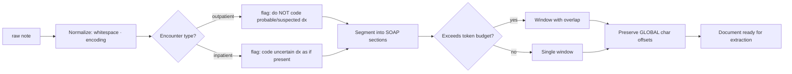

Notes may span multiple pages; long notes are **windowed with overlap** and facts
are merged/deduped afterward, with **global character offsets preserved** so
evidence spans always point back to the original note.

### 9.2 Extraction + assertion

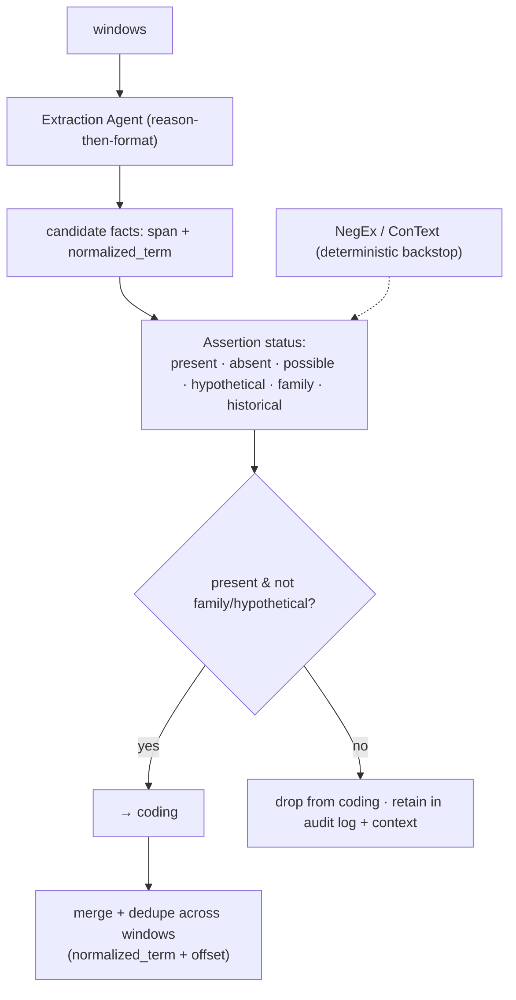

`normalized_term` (a canonical clinical phrase, emitted by the LLM alongside the
verbatim span) is what feeds retrieval — more robust than raw note text. The
assertion step is our single biggest **false-positive defense**: a *ruled-out* or
*family-history* finding must never be coded as an active diagnosis.

### 9.3 Retrieve-then-constrain (code retrieval / filtering strategy)

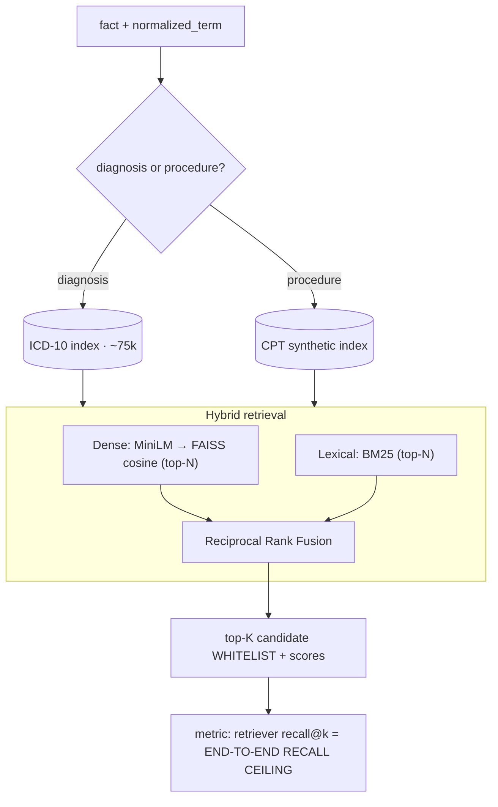

- **Hybrid (not pure-vector):** BM25 nails exact clinical terms ("type 2
  diabetes"), embeddings catch paraphrases; **RRF** fuses them without tuning
  score scales. This is the empirically dominant pattern for code retrieval.
- **The whitelist is a hard constraint**, not soft context — the coder can only
  emit codes that exist in the catalog. Hallucinated codes become *structurally
  impossible*.
- **Production swap (documented):** replace FAISS+BM25 with **Postgres —
  `pgvector` (semantic) + `tsvector` (full-text) + `pg_trgm` (fuzzy)** — one
  datastore for hybrid search behind the same `Retriever` interface.

### 9.4 / 9.5 Coding & Verification — see §8.3.

### 9.6 Rule engine (deterministic symbolic checks) + warning taxonomy

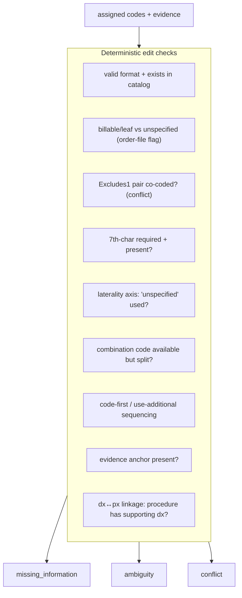

Warning types map **1:1 to the brief** and are grounded in the **ICD-10-CM
Official Guidelines**:

| Coding rule (guideline)                                       | missing_information | ambiguity | conflict |
| ------------------------------------------------------------- | :-----------------: | :-------: | :------: |
| Unspecified code where specifics documented (I.B.18)          |         ✓         |    ✓    |          |
| Laterality not captured (I.B.13)                              |         ✓         |    ✓    |          |
| Missing/invalid 7th character (Ch.19)                         |         ✓         |    ✓    |          |
| Combination code available but split (I.B.9)                  |                    |          |    ✓    |
| Code-first / use-additional missing or mis-sequenced (I.B.7)  |         ✓         |          |    ✓    |
| **Excludes1 pair co-coded (I.A.12)**                    |                    |          |    ✓    |
| Symptom coded alongside its definitive dx (I.B.5)             |                    |          |    ✓    |
| Uncertain dx ("probable/suspected"), by encounter type (IV.H) |         ✓         |    ✓    |    ✓    |
| No documentation anchor for a code (auditability)             |         ✓         |          |          |
| Procedure with no supporting diagnosis (medical necessity)    |         ✓         |          |    ✓    |

**Honest scope note:** format/exists/billable/laterality-by-structure and a
curated Excludes1 subset are implementable from the bundled ICD-10 code + order
files. *Full* guideline coverage (complete Excludes1 graph, code-first chains,
CPT NCCI PTP/MUE edits) requires the public-domain ICD-10 **tabular XML** / CMS
NCCI tables and is wired as an **extensible rule set** (documented extension, not
fully built in the 1-day scope). Judgment checks (is a more specific code
*supported by the narrative*? is the symptom integral?) are delegated to the
**LLM auditor** — per the research split of deterministic vs. LLM checks.

### 9.7 Confidence model

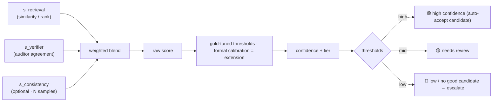

We **never surface raw LLM confidence** (it is systematically overconfident).
We blend independent signals and present a **3-tier label (🟢🟡🔴) + evidence
span**, with thresholds tuned on the gold set. *Formal* calibration (isotonic /
Platt + ECE) is the rigorous method but needs a larger labeled set than a small
authored gold set supports — so it is a **documented extension, not shipped**
(keeping the core minimal).

### 9.8 Assembly / output

Deterministic step builds the validated `CodingResult` (below), attaches
`RunMetadata` (audit + metrics), and emits JSON to stdout / file.

---

## 10. Data model / schemas

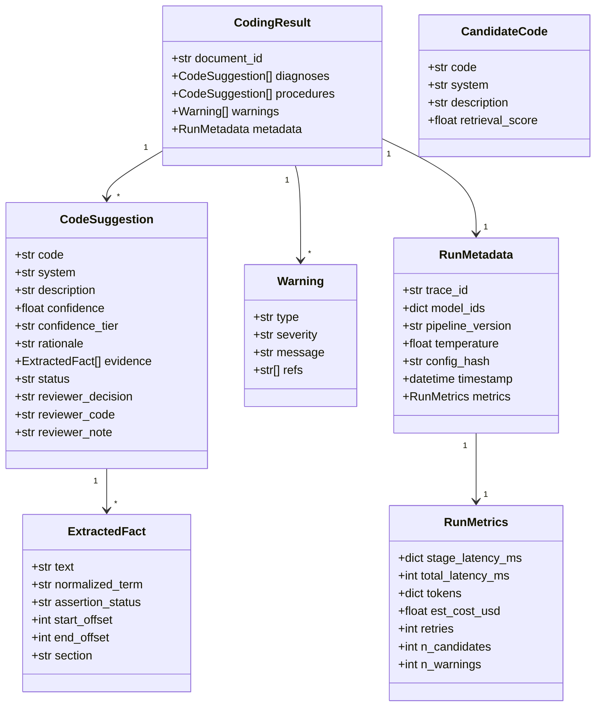

`Warning.type ∈ {missing_information, ambiguity, conflict}`.
`assertion_status ∈ {present, absent, possible, hypothetical, family, historical}`.

---

## 11. Reviewer override lifecycle

The payload is built for human override — each suggestion carries a mutable
decision:

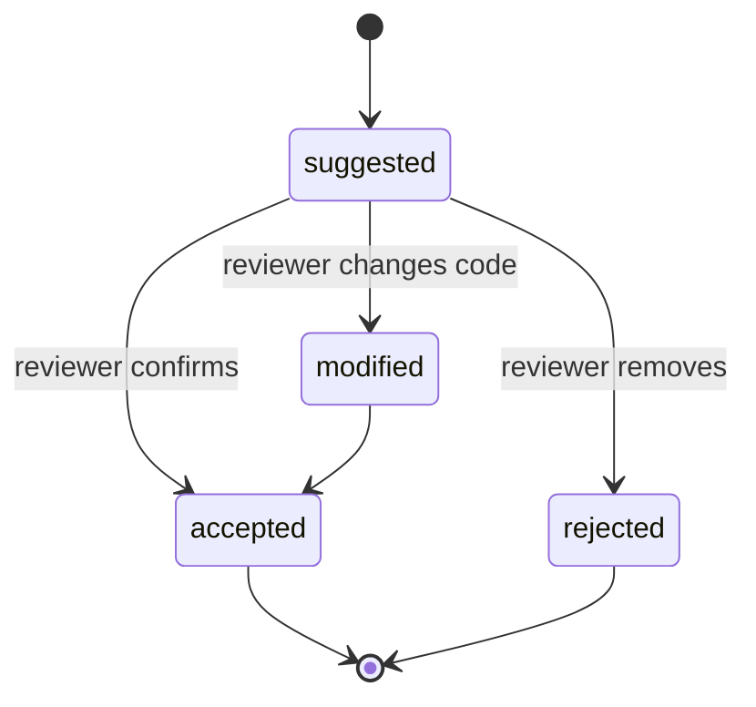

This is why no UI is required: the JSON contract itself supports review/override.

---

## 12. Reproducibility & determinism

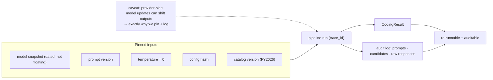

Reproducibility comes from **bounded sampling (temp=0 where honoured, else low
reasoning_effort) + pinned model IDs (e.g. `openai/gpt-5.4-mini`) + versioned
prompts + full logging** — *not* from the test
mock. The mock only makes the *test suite* deterministic and keyless. We are
honest that bit-for-bit determinism isn't guaranteed across provider model
updates, which is the reason we pin and log everything.

---

## 13. Reliability & observability

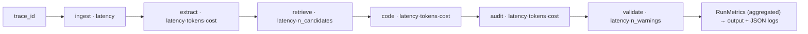

- **Observability** (a JD focus, named 3×): per-stage latency, per-call tokens +
  estimated cost (via LiteLLM), retry/candidate/warning counts — all in
  `RunMetadata.metrics` and structured logs keyed by `trace_id`.
- **Reliability:** retry+backoff on LLM calls; **per-fact graceful degradation**
  (a failed fact becomes a warning, not a crashed run); **response caching by
  input hash** (latency + cost + repeatability); **enforced structured output**
  with validate→repair-retry.
- **Structured output enforcement (LiteLLM, verified):** `response_format` accepts
  Pydantic models; `enable_json_schema_validation=True` as a client-side safety
  net; `supports_response_schema()` to pick schema-capable backends; `mock_response`
  for deterministic CI (tool-call shapes mocked manually).
- **Observability tooling — deliberately calibrated:** the core ships
  **self-contained** structured JSON traces + `RunMetadata.metrics` — nothing to
  run, fully satisfies the brief's "tracing suitable for audit," and *is* the same
  signal an LLM-observability platform would show. LiteLLM's **native callbacks**
  make **Langfuse / OpenTelemetry** export an **opt-in env flag** (off by default —
  no key or service required to run). Full dashboards
  (**Grafana + Prometheus/Loki/Tempo**) are a **production extension**,
  intentionally out of scope for an offline CLI (no live service to monitor).

---

## 14. Evaluation strategy (`make eval`)

Reported per note then aggregated, **split for ICD vs CPT**:

1. **Micro precision / recall / F1** — headline (weights each code decision equally).
2. **Macro P/R/F1** — arithmetic mean of per-class F1 (avoiding the harmonic-mean
   trap), stating absent-code handling.
3. **Exact Match Ratio** — notes where predicted set == gold set (harsh, honest).
4. **Hierarchical / partial-credit micro-F1** — re-scored after truncating both
   sides to the 3-char category; the `{exact, category}` gap = "right area, wrong
   specificity."
5. **Retriever recall@k** — *standalone* metric; the **end-to-end recall ceiling**.
6. **MAP / P@k** — for the ranked candidate lists.
7. **HITL metrics (design-level):** reviewer acceptance rate, edit/correction
   rate, **auto-accept precision** (the safety-critical one), time-per-note.

Expectations are set honestly: literature ceilings are ~0.4–0.7 micro-F1; we do
**not** chase 0.9, and small-gold macro numbers are flagged as directional.

---

## 15. Tech stack & runtime/deployment

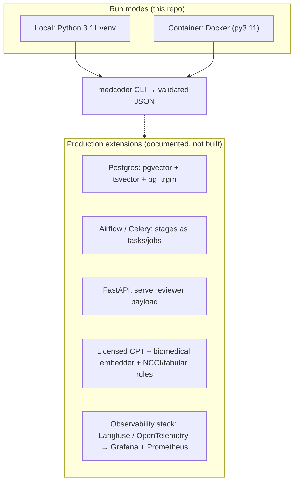

**Stack:** Python 3.11 · **LiteLLM** (multi-provider gateway) ·
sentence-transformers (`all-MiniLM-L6-v2`, swappable) · FAISS · rank-bm25 ·
Pydantic + pydantic-settings · Typer · structured JSON logging · pytest · ruff ·
Docker · pandoc (PDF). Each pipeline stage is **idempotent and independently
retryable**, so it maps cleanly to an **Airflow task / Celery job** in production.

---

## 16. Key technical decisions & trade-offs (ADR-style)

| Decision                                                           | Rationale                                            | Trade-off accepted                                             |
| ------------------------------------------------------------------ | ---------------------------------------------------- | -------------------------------------------------------------- |
| **Retrieve-then-constrain** (whitelist, not free generation) | Eliminates hallucinated codes; makes 75k tractable   | Bounded by retriever recall@k                                  |
| **Coder + independent Auditor** (multi-LLM)                  | Best precision/recall (MDPI); cuts correlated errors | Extra LLM calls → mitigated by selective+batched verification |
| **Hybrid retrieval + RRF**                                   | Exact terms*and* paraphrases; no score tuning      | Two indexes to build                                           |
| **Enforced structured output, reason-then-format**           | Valid payloads; preserves reasoning quality          | Repair/retry complexity                                        |
| **temp=0 + pinned snapshots** over sampling                  | Reproducibility/auditability requirement             | Forgoes self-consistency accuracy (offered as optional)        |
| **Blended + calibrated confidence**                          | Raw LLM confidence is overconfident                  | Needs a gold set to calibrate                                  |
| **Deterministic rule engine** for hard checks                | Auditable, exact, no LLM cost                        | Full guideline coverage needs tabular/NCCI data                |
| **Real ICD-10 + synthetic CPT**                              | Real large-space retrieval; legal                    | CPT demo on synthetic codes                                    |
| **LiteLLM**                                                  | Multi-provider in one call; built-in mocking         | Thin dependency                                                |
| **CLEAN scope: CLI-only core**                               | Matches the offline brief; no over-build             | FastAPI/UI are extensions                                      |

---

## 17. Limitations & honest caveats

- **Assistive, not autonomous** — SOTA full-space micro-F1 ≈ 0.54; a human
  reviewer is required by design.
- **Confidence is calibrated guidance, not a clinical probability.**
- **CPT is synthetic** (licensing) and **CPT coding is under-evidenced** in the
  literature — its accuracy should be validated separately; architecture is
  drop-in for licensed CPT.
- **General embedder** is a demo compromise; biomedical embedder is the prod choice.
- **Full coding-guideline coverage** (complete Excludes1, sequencing, NCCI) needs
  the tabular/NCCI data refresh pipeline — wired as an extension.
- **Reproducibility** is engineered but not bit-for-bit guaranteed across
  provider model updates (hence pinning + logging).
- **Eval** is illustrative on a small authored gold set, not a benchmark.

**Extensions:** Postgres hybrid search · biomedical/SapBERT embeddings + SNOMED→ICD
crosswalk · full tabular-rule + NCCI engine · FastAPI + reviewer UI · self-
consistency confidence · provider-query drafting · licensed CPT · **LLM-observability
tooling (opt-in Langfuse/OpenTelemetry via LiteLLM callbacks; Grafana+Prometheus
dashboards in production).**

---

## 18. Scope tiers & implementation phases (TDD)

**Tier 1 (ships on its own):** ingestion → extraction(+assertion) → hybrid
retrieval → coder → **selective auditor** → core rule engine → confidence →
`CodingResult`; CLI; Docker; structured logging + metrics; `make eval` + gold set;
consistency test; real ICD-10 + synthetic CPT + synthetic notes; DESIGN.md → PDF.
**Tier 2 (only if Tier 1 solid):** FastAPI, docker-compose, redaction toggle,
full tabular rules, expanded tests.

| Phase       | Deliverable                                                                                                                                                                |
| ----------- | -------------------------------------------------------------------------------------------------------------------------------------------------------------------------- |
| 1           | Scaffold + Pydantic schemas + JSON logging +`.gitignore` + `git init`                                                                                                  |
| 2           | Catalog load (real ICD-10 + synthetic CPT) +`build_index` + hybrid `Retriever` + retrieval/recall@k tests                                                              |
| 3*(core)* | `llm.py` LiteLLM wrapper (reason-then-format, repair, caching, token/cost) + **versioned prompts** for extraction/coder/auditor + mock fixtures + consistency test |
| 4*(core)* | Pipeline stages (ingest→extract→retrieve→code→audit→rules→assemble) + graceful degradation + deterministic e2e test                                                  |
| 5           | Typer CLI + Dockerfile + Makefile (build-index/run/test/eval/lint/pdf)                                                                                                     |
| 6           | Authored synthetic notes + gold labels +`evaluate.py` + DESIGN.md → PDF + README                                                                                        |

---

## 19. Repository structure

```
README.md  pyproject.toml  Dockerfile  .env.example  LICENSING.md  DATA_LICENSE
Makefile  .gitignore
data/  icd10cm_codes_2026.txt(real)  procedures_synthetic.csv  notes/*.txt  gold/labels.json
src/medcoder/
  config.py            # LLM_MODEL, VERIFIER_MODEL, thresholds, paths, embedder
  schemas.py           # Pydantic models (§10)
  ingest.py            # normalize, encounter type, segment, window, offsets
  extract.py           # extraction agent + assertion
  retrieval/ index.py vector.py(FAISS) lexical.py(BM25) hybrid.py(Retriever, RRF)
  code_assign.py       # coder agent (whitelist-constrained)
  verify.py            # auditor agent (independent model, selective/batched)
  rules.py             # deterministic edit checks → warnings
  confidence.py        # blend + calibrate + tiers
  pipeline.py          # orchestration, per-stage timing, graceful degradation
  llm.py               # LiteLLM wrapper: structured output + repair + cache + cost
  logging_setup.py     # JSON logs + trace_id
  cli.py               # Typer
scripts/ build_index.py  evaluate.py
tests/  test_schemas.py test_ingest.py test_retrieval.py test_rules.py
        test_pipeline_mock.py test_consistency.py  conftest.py(LiteLLM mocks)
docs/  DESIGN.md → PDF
[Tier 2] api.py(FastAPI)  docker-compose.yml
```

---

## 20. References (accessed 2026-06-25)

**LLM medical coding:** LLMs Are Poor Medical Coders (NEJM AI 2024); Code Like
Humans (EMNLP 2025, arXiv:2509.05378); Coder/Auditor on MIMIC-IV (MDPI Informatics
2026); retrieve-then-rerank (arXiv:2407.12849); MedCodER (arXiv:2409.15368);
Anatomy of Evidence (arXiv:2507.01802).
**Verification / multi-agent:** Can't Self-Correct Reasoning Yet (Huang et al.,
ICLR 2024, arXiv:2310.01798); Chain-of-Verification (arXiv:2309.11495); MAST — Why
Multi-Agent Systems Fail (NeurIPS 2025, arXiv:2503.13657); LLM-as-judge biases
(arXiv:2306.05685, 2410.21819); heterogeneous debate A-HMAD (2025).
**Structured output / format:** Let Me Speak Freely? (arXiv:2408.02442); LiteLLM
JSON mode + mock docs.
**Confidence / calibration:** Xiong et al. confidence elicitation
(arXiv:2306.13063); Just Ask for Calibration (arXiv:2305.14975).
**Assertion/negation:** assertion-status classification (arXiv:2503.17425);
NegEx/ConText.
**Evaluation:** MIMIC replicability (Edin et al., SIGIR 2023, arXiv:2304.10909);
CodiEsp/CLEF (MAP); ICD-hierarchy metric choice (Falis et al.); retrieve-and-rerank
recall@k (JBI 2023).
**Domain rules:** ICD-10-CM Official Guidelines FY2026 (CMS/CDC); AHIMA/ACDIS
compliant query practice; CMS NCCI PTP/MUE; AMA CPT modifiers.
**Data/licensing:** CDC ICD-10-CM FY2026 files (public domain); AMA CPT licensing
FAQ (no free tier); PhysioNet/n2c2 DUAs; Synthea (Apache-2.0).

```

```
