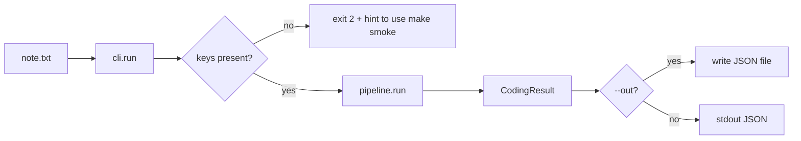
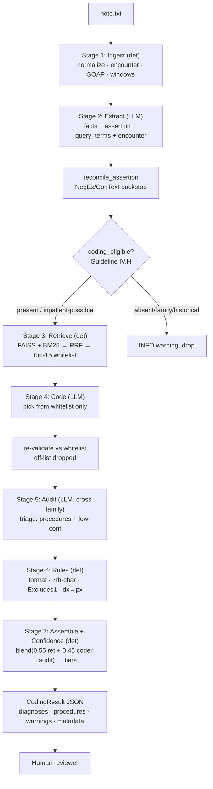

# `medcoder` — End-to-End Walkthrough

> A guided tour of the medical-coding pipeline, from a raw clinical note on disk
> to the reviewer-ready JSON report. Each stage below shows its **input**,
> **logic**, **prompt** (where an LLM is involved), **output**, and the **files**
> that implement it.
>
> **Where this fits.** The primary deliverable is the 1–2 page **`docs/DESIGN.pdf`**
> (architecture, retrieval strategy, prompting, trade-offs, limitations). `README.md`
> is the runbook. *This* file is the optional deep-dive: read it if you want to see
> exactly how a note becomes codes, stage by stage, with the real files and offsets.
> It is documentation only — nothing in the pipeline was changed to produce it.
>
> **Want to see real output first?** Pre-run, real-API results for all four notes are
> committed under [outputs/](outputs/): each note has a `result.json` (machine/audit
> payload), a `result.md` (human review sheet), and a `trace.json` (the per-stage
> decision trail). `outputs/eval/metrics.json` holds the gold-set scores. You can read
> them without running anything; `make run` overwrites your local copy.

---

## 0. The 30-second mental model

The pipeline turns one clinical note into a list of suggested ICD-10-CM
diagnoses + (synthetic) CPT procedures, each carrying confidence, verbatim
evidence, and typed warnings for a human coder to accept or override.

The core design idea: **the LLM never invents a code.** Retrieval produces a
*whitelist* of real catalog codes; the coder LLM may only choose from that
whitelist; an independent auditor LLM (different model family) second-guesses the
choices; and a deterministic rule engine adds compliance warnings. Hallucinated
codes are therefore *structurally impossible*, not just discouraged.

```
                 ┌───────────────────────────────────────────────────────────────┐
                 │                     medcoder pipeline                         │
   note.txt ──▶  │  ingest → extract → retrieve → code → audit → rules → assemble│ ──▶  CodingResult JSON
                 │   (det)    (LLM)     (det)     (LLM)   (LLM)   (det)   (det)  │      (for human review)
                 └───────────────────────────────────────────────────────────────┘
   (det) = deterministic / no LLM        (LLM) = model call via LiteLLM gateway
```

Orchestrator: [src/medcoder/pipeline.py](src/medcoder/pipeline.py) — the single
`run()` function wires all seven stages together.

---

## 1. Entry points — how a run starts

| You run…                               | What happens                                                                       | File                                                    |
| --------------------------------------- | ---------------------------------------------------------------------------------- | ------------------------------------------------------- |
| `medcoder run note.txt`               | Live run (needs LLM keys); prints JSON **and** saves `outputs/<doc_id>/`         | [src/medcoder/cli.py:31](src/medcoder/cli.py#L31)          |
| `make smoke`                          | Full pipeline on the real ICD-10 index with**canned** LLM responses (no key) | [scripts/smoke_with_mocks.py](scripts/smoke_with_mocks.py) |
| `make eval`                           | Runs every gold note and prints P/R/F1, recall@k, latency, cost                   | [scripts/evaluate.py](scripts/evaluate.py)                 |
| `make examples`                       | Regenerates the committed [outputs/](outputs/) (live run on every note + metrics) | [scripts/generate_examples.py](scripts/generate_examples.py) |
| `medcoder retrieve "type 2 diabetes"` | Retrieval-only probe (no LLM) — great for sanity checks                           | [src/medcoder/cli.py:172](src/medcoder/cli.py#L172)        |
| `medcoder build-index`                | Builds the FAISS + BM25 indexes on disk                                            | [src/medcoder/cli.py:126](src/medcoder/cli.py#L126)        |

The `run` command does this before/after invoking the pipeline
([cli.py:31-123](src/medcoder/cli.py#L31-L123)):

1. Resolves settings and applies `--no-verify` / log flags.
2. **Pre-flight key check** — because the default config is *cross-family*
   (OpenAI coder + Anthropic auditor), it checks that a key exists for every
   model it will actually call. The *coder* path is mandatory (hard exit if its
   key is missing); the *auditor* is optional, so a missing auditor key degrades
   to `--no-verify` with a warning rather than crashing.
3. Reads the note text and calls `run_pipeline(text, document_id=...)`.
4. Writes the result to stdout **and**, by default, persists a self-contained
   `outputs/<doc_id>/` folder: `result.json` (or `result.md` with `--format md`)
   plus `trace.json`, the per-stage audit trail (§11b). `--no-save` opts out;
   `--out PATH` writes a single file to an exact path instead.



---

## 2. The data layer (what the pipeline reads)

Everything the pipeline depends on lives under [data/](data/):

| Artifact                                                                      | What it is                                                                                                    | Loaded by                                           |
| ----------------------------------------------------------------------------- | ------------------------------------------------------------------------------------------------------------- | --------------------------------------------------- |
| [data/notes/](data/notes/)                                                       | 4 authored synthetic clinical notes (the inputs)                                                              | CLI / eval                                          |
| [data/catalogs/icd10cm_codes_2026.txt](data/catalogs/icd10cm_codes_2026.txt)     | **Real** CDC ICD-10-CM catalog (~75k codes), `CODE   description` per line                            | [catalog.py:30](src/medcoder/retrieval/catalog.py#L30) |
| [data/catalogs/procedures_synthetic.csv](data/catalogs/procedures_synthetic.csv) | **Synthetic** CPT-shaped catalog (`code,description`) — CPT is proprietary, so a stand-in is shipped | [catalog.py:59](src/medcoder/retrieval/catalog.py#L59) |
| [data/index/](data/index/)                                                       | Prebuilt`*.faiss` (dense) + `*.bm25.pkl` (lexical) indexes per system                                     | [hybrid.py](src/medcoder/retrieval/hybrid.py)          |
| [data/gold/labels.json](data/gold/labels.json)                                   | Gold codes per note, split into`must_include` / `may_include`                                             | [evaluate.py](scripts/evaluate.py)                     |

**Catalog normalization detail:** CMS distributes ICD-10 codes without the dot
(`E1142`); the loader re-inserts it (`E11.42`) so reviewers and the rule engine
see the canonical dotted form — [catalog.py:20-27](src/medcoder/retrieval/catalog.py#L20-L27).

---

## 3. The shared data contracts

Before walking the stages, note that every stage exchanges **Pydantic models**
defined in [src/medcoder/schemas.py](src/medcoder/schemas.py). The important ones:

```
ExtractedFact   →  one clinical concept + verbatim span + assertion status   (extract output)
CandidateCode   →  one retrieved catalog code + fused score/ranks            (retrieve output)
CodedAssignment →  (fact, chosen candidate, coder choice)                    (code output)
AuditOutcome    →  a CodedAssignment + auditor agree/disagree                (audit output)
CodeSuggestion  →  one reviewer-facing suggested code + confidence + evidence (assemble output)
CodingResult    →  the whole report: diagnoses[], procedures[], warnings[], metadata   ← FINAL
```

The agents also have strict I/O schemas (`ExtractionResponse`, `CoderResponse`,
`AuditorResponse`, …) — these are what `response_format=` enforces on each LLM
call, so a model literally cannot return malformed JSON without triggering a
repair retry.

---

## 4. Stage 1 — Ingest (deterministic)

**File:** [src/medcoder/ingest.py](src/medcoder/ingest.py) ·
**Called from:** [pipeline.py:123](src/medcoder/pipeline.py#L123) (inside the `timed("ingest")` block at L122)

```
raw note text ──▶  normalize ──▶ detect encounter type ──▶ SOAP segment ──▶ window ──▶ IngestedNote
```

| Step           | Logic                                                                                                        | Function                                             |
| -------------- | ------------------------------------------------------------------------------------------------------------ | ---------------------------------------------------- |
| Normalize      | Collapse space/newline runs, normalize line endings; offsets become stable relative to the normalized text   | [`normalize`](src/medcoder/ingest.py#L23)             |
| Encounter type | Keyword heuristic: inpatient vs outpatient hints; tie → outpatient (the more conservative coding rule)      | [`detect_encounter_type`](src/medcoder/ingest.py#L68) |
| SOAP segment   | Regex over section headers (Subjective/Objective/Assessment/Plan/HPI/…)                                     | [`segment_soap`](src/medcoder/ingest.py#L111)         |
| Window         | Split notes > 6000 chars into overlapping windows on sentence boundaries,**preserving global offsets** | [`window_text`](src/medcoder/ingest.py#L144)          |

**Why global offsets matter:** every evidence span in the final report must point
back into the *original* note, not into a window slice. The window carries its
`start` so downstream stages can translate window-local offsets to global ones.

**Input** (note_01):

```
PATIENT: Jordan Reyes ...
ENCOUNTER: Outpatient — Primary Care Follow-Up
...
Assessment:
1. Type 2 diabetes mellitus with diabetic polyneuropathy ...
```

**Output** (`IngestedNote`):

```python
IngestedNote(
  text="…normalized…",
  encounter_type=EncounterType.OUTPATIENT,   # "primary care", "follow-up", "outpatient" hints
  sections=[Section(name="subjective", …), Section(name="objective", …), …],
  windows=[Window(start=0, end=…, index=0)], # single window — note is short
)
```

> Note: the encounter type from ingest is a *heuristic fallback*. The extraction
> LLM also classifies the encounter (Stage 2), and the pipeline prefers the LLM's
> answer when it is confident — see [pipeline.py:158-163](src/medcoder/pipeline.py#L158-L163).

---

## 5. Stage 2 — Extract (LLM + deterministic backstop)

**File:** [src/medcoder/extract.py](src/medcoder/extract.py) ·
**Prompt:** [src/medcoder/prompts/extraction_p2.txt](src/medcoder/prompts/extraction_p2.txt) ·
**Called from:** [pipeline.py:141](src/medcoder/pipeline.py#L141)

The extraction agent reads each window and emits one `ExtractedFact` per clinical
concept, plus a note-level `encounter_type`.

```
window text ─▶ [LLM: extraction agent] ─▶ ExtractionResponse
                                              │
                       per fact: offset-translate → snap text to offset → reconcile assertion
                                              ▼
                                 merge/dedupe across windows → facts[]
```

**Prompt asks the model for, per fact** ([extraction_p2.txt](src/medcoder/prompts/extraction_p2.txt)):

- `text` — verbatim span
- `normalized_term` — canonical lookup phrase (e.g. "type 2 diabetes mellitus", not "DM type 2")
- `query_terms` — 0-3 synonyms/expansions to **widen retrieval recall** (new in prompt `p2`)
- `assertion_status` — present / absent / possible / hypothetical / family / historical
- `start_offset` / `end_offset`, `section`, `kind` (diagnosis|procedure|symptom)
- plus a note-level `encounter_type`

**Deterministic safety backstop** — [`reconcile_assertion`](src/medcoder/extract.py#L65):
small NegEx/ConText-style regex scanners catch the most common LLM polarity slip.
If the model marked something `present` but the text just before it says
"denies"/"no"/"rule out"/"family history of"/"history of", the code **overrules**
it to `absent`/`possible`/`family`/`historical`. It only ever overrules in the
*safe* direction (it never upgrades absent→present). Example from note_01:
"He denies chest pain" → `chest pain` is forced to `absent`.

**Offset hardening** — [extract.py:155-174](src/medcoder/extract.py#L155-L174):
the LLM's character offsets drift, so the code snaps each span to what's actually
at that offset (or relocates by exact string match within the window).

**Output** (`ExtractionResult`, abbreviated):

```python
facts = [
  ExtractedFact(text="type 2 diabetes mellitus", normalized_term="type 2 diabetes mellitus with polyneuropathy",
                assertion_status=PRESENT, kind="diagnosis", section="assessment", start_offset=…),
  ExtractedFact(text="essential hypertension", assertion_status=PRESENT, kind="diagnosis", …),
  ExtractedFact(text="diabetic nephropathy", …),
  ExtractedFact(text="obesity", …),
  ExtractedFact(text="comprehensive diabetic foot examination", kind="procedure", …),
  ExtractedFact(text="denies chest pain", assertion_status=ABSENT, …),   # reconciled, will be dropped
]
encounter_type = EncounterType.OUTPATIENT
```

### 5b. The coding-eligibility gate (between extract and retrieve)

**File:** [`coding_eligible`](src/medcoder/extract.py#L189) ·
**Applied in:** [pipeline.py:164](src/medcoder/pipeline.py#L164)

This implements **ICD-10-CM Guideline IV.H**: outpatient encounters must *not*
code "possible/probable/suspected" diagnoses; inpatient encounters may. So:

- `present` facts → always codable.
- `possible` facts → codable **only** if encounter is inpatient.
- `absent` / `family` / `historical` / `hypothetical` → dropped from coding (kept
  as context), each emitting an `INFO` warning.

For note_01 (outpatient), the `denies chest pain` fact is dropped here with an
info warning; the four diagnoses + one procedure proceed.

---

## 6. Stage 3 — Retrieve (deterministic, hybrid)

**Files:** [hybrid.py](src/medcoder/retrieval/hybrid.py) ·
[vector.py](src/medcoder/retrieval/vector.py) ·
[lexical.py](src/medcoder/retrieval/lexical.py) ·
**Called from:** [`_retrieve_for_facts`](src/medcoder/pipeline.py#L78)

For each codable fact, the retriever produces the **whitelist** of real catalog
codes the coder is allowed to choose from. It's a hybrid of two retrievers fused
by Reciprocal Rank Fusion (RRF):

```
                    ┌──────────────── dense (FAISS) ───────────────┐
 normalized_term ─▶ │ MiniLM embedding → cosine top-50             │ ─┐
 + query_terms      └──────────────────────────────────────────────┘  │  RRF fuse
                    ┌──────────────── lexical (BM25) ──────────────┐  │  score = Σ 1/(k+rank)
                    │ Okapi BM25 over descriptions → top-50         │ ─┘  k = 60, 0-based rank (+1 in formula)
                    └──────────────────────────────────────────────┘
                                          │
                          top-15 CandidateCode[] per fact (the whitelist)
```

- **Dense** — [vector.py](src/medcoder/retrieval/vector.py): the
  `sentence-transformers/all-MiniLM-L6-v2` embedder (full config string at
  [config.py:87](src/medcoder/config.py#L87)), L2-normalized, in a FAISS
  `IndexFlatIP` (inner product = cosine). Production swap noted as SapBERT/PubMedBERT.
- **Lexical** — [lexical.py](src/medcoder/retrieval/lexical.py): `BM25Okapi`
  (k1=1.5, b=0.75) over catalog descriptions — catches exact clinical phrasing
  the embeddings paraphrase past.
- **Fusion** — [hybrid.py:58-97](src/medcoder/retrieval/hybrid.py#L58-L97): RRF
  needs no score calibration between the two scorers (cosine ≠ BM25); each
  contributes `1/(rrf_k + rank)` with a 1-based rank. (The code enumerates
  0-based and adds 1: `1.0 / (rrf_k + rank + 1)` at [hybrid.py:72](src/medcoder/retrieval/hybrid.py#L72).)

**Query expansion** — [pipeline.py:89-101](src/medcoder/pipeline.py#L89-L101):
the retriever is run on `normalized_term` **and** each `query_terms` synonym,
then candidates are merged keeping the best score per code, and re-ranked. This
widens recall without relaxing the whitelist. The final post-merge position is
written back to each candidate's `fused_rank` (which feeds confidence later).

`diagnosis`/`symptom` facts query the ICD-10 index; `procedure` facts query the
CPT index — [`_kind_to_system`](src/medcoder/pipeline.py#L74).

**Output** for the "type 2 diabetes…polyneuropathy" fact (abbreviated):

```python
[
  CandidateCode(code="E11.42", description="Type 2 diabetes mellitus with diabetic polyneuropathy",
                retrieval_score=0.0312, dense_rank=1, lexical_rank=2, fused_rank=1),
  CandidateCode(code="E11.40", description="Type 2 diabetes mellitus with diabetic neuropathy, unspecified", …),
  CandidateCode(code="E11.9",  description="Type 2 diabetes mellitus without complications", …),
  …up to 15…
]
```

---

## 7. Stage 4 — Code (LLM, whitelist-constrained)

**File:** [src/medcoder/code_assign.py](src/medcoder/code_assign.py) ·
**Prompt:** [src/medcoder/prompts/coder_p1.txt](src/medcoder/prompts/coder_p1.txt) ·
**Called from:** [pipeline.py:205](src/medcoder/pipeline.py#L205)

One **batched** LLM call covers every fact in the note. The coder receives each
fact bundled with its candidate whitelist and must pick the best code(s) **from
that list only**.

```
{fact, candidates[]}[] ─▶ [LLM: coder agent] ─▶ CoderResponse
                                                    │
                          re-validate every chosen code against the whitelist
                                                    ▼
                          off-list codes DROPPED + logged → CodedAssignment[]
```

**The structural guarantee** — [code_assign.py:112-126](src/medcoder/code_assign.py#L112-L126):
even though the prompt says "only choose from candidates", the code *re-validates*
every returned code against the candidate set and silently drops anything off-list
(logging `coder_offlist_code_dropped`). This is the mechanism that makes ICD-10
hallucination impossible — the prompt is a request, this check is the enforcement.

**Prompt highlights** ([coder_p1.txt](src/medcoder/prompts/coder_p1.txt)):

- "You may NEVER emit a code that is not in the candidate list."
- Prefer the **most specific** supported code; don't pick "unspecified" when
  specifics are documented.
- Calibrated confidence in [0,1]; reserve >0.85 for unambiguous cases.
- `choices` length 0 = "no candidate fits" (becomes a low-conf warning, not a guess).

**Output** (`CodedAssignment[]`, one per accepted code):

```python
CodedAssignment(fact=<T2DM polyneuropathy>, candidate=E11.42,
                choice=CoderCodeChoice(code="E11.42", confidence=0.86,
                       rationale="Assessment names T2DM with diabetic polyneuropathy; monofilament reduced bilaterally."))
CodedAssignment(fact=<HTN>, candidate=I10,  choice=… confidence=0.91 …)
CodedAssignment(fact=<nephropathy>, candidate=E11.21, … 0.78 …)
CodedAssignment(fact=<obesity>, candidate=E66.9, … 0.72 …)
CodedAssignment(fact=<foot exam>, candidate=9T0012, … 0.90 …)   # CPT (synthetic)
```

---

## 8. Stage 5 — Audit (independent LLM, cross-family)

**File:** [src/medcoder/verify.py](src/medcoder/verify.py) ·
**Prompt:** [src/medcoder/prompts/auditor_p1.txt](src/medcoder/prompts/auditor_p1.txt) ·
**Called from:** [pipeline.py:223](src/medcoder/pipeline.py#L223)

A **different model family** (default: Anthropic Claude Haiku vs the OpenAI coder)
independently judges each (evidence, code) pair: does the documented evidence
justify *this exact code at this specificity*? The auditor never assigns
replacements — it only agrees/disagrees and notes why.

**Cost-aware triage** — [`_needs_audit`](src/medcoder/verify.py#L41): the auditor
is not run on everything. It fires when:

- the code is a **procedure** (high cost of error, smaller list) — always; or
- the coder's confidence ≤ `audit_low_conf_threshold` (default 0.75).

High-confidence diagnoses skip the audit (the whitelist + assertion checks are
deemed enough). Audited pairs go in one batched call.

```
CodedAssignment[] ─▶ triage (_needs_audit) ─▶ pairs to audit ─▶ [LLM: auditor] ─▶ AuditorResponse
                                                                                     │
                                          per assignment: agree=True/False/None (None = skipped)
                                                                                     ▼
                                                                              AuditOutcome[]
```

For note_01: the procedure (9T0012) and the lower-confidence diagnoses get
audited; all agree. A disagreement (`agree=False`) later becomes a `WARN` warning
and a −0.30 confidence penalty.

> Graceful degradation: if the auditor key is unfunded or the call fails, the
> pipeline catches it ([pipeline.py:226-237](src/medcoder/pipeline.py#L226-L237)),
> emits an info warning, and continues with `agree=None` — codes are shown
> "without independent verification" rather than crashing the run.

---

## 9. Stage 6 — Rules (deterministic compliance engine)

**File:** [src/medcoder/rules.py](src/medcoder/rules.py) ·
**Called from:** [pipeline.py:242](src/medcoder/pipeline.py#L242)

A symbolic post-constraint that adds typed `Warning`s the LLMs can't reliably
self-check. Per assignment and pairwise:

| Check                   | What it flags                                                                                                                                                       | Severity |
| ----------------------- | ------------------------------------------------------------------------------------------------------------------------------------------------------------------- | -------- |
| Format / catalog        | Code doesn't match ICD-10 / CPT shape                                                                                                                               | BLOCK    |
| Evidence anchor         | Code has no backing fact span                                                                                                                                       | WARN     |
| Unspecified specificity | "unspecified" code at <0.9 conf — verify a more specific variant isn't documented                                                                                  | INFO     |
| 7th character           | S/T/O chapters + six specific M subranges (M48.4, M48.5, M84.3–M84.6) that require an initial/subsequent/sequela extension —[rules.py:61](src/medcoder/rules.py#L61) | WARN     |
| Excludes1 pairs         | Curated mutually-exclusive pairs (E10↔E11, I10↔I11, J44↔J45) both present                                                                                        | WARN     |
| dx↔px linkage          | Procedures coded with no supporting diagnosis (medical necessity)                                                                                                   | WARN     |

These are honest *subsets* of the official guidelines — the
[rules.py](src/medcoder/rules.py) docstring notes the full Excludes1/7th-char
graph needs the ICD-10 tabular XML (documented as an extension). **Output:** a
flat `Warning[]` appended to the run's warnings.

---

## 10. Stage 7 — Assemble + Confidence (deterministic)

**Files:** [`_to_suggestions`](src/medcoder/pipeline.py#L296) ·
[src/medcoder/confidence.py](src/medcoder/confidence.py) ·
**Called from:** [pipeline.py:249-250](src/medcoder/pipeline.py#L249-L250)

Each `AuditOutcome` becomes a reviewer-facing `CodeSuggestion`. The headline
number is a **blended, calibrated-ish confidence** — the raw LLM confidence is
*never* surfaced directly because verbalized LLM confidence is systematically
overconfident.

**Blend** — [`blend`](src/medcoder/confidence.py#L53):

```
s_ret   = retrieval-strength from fused rank   (rank 1 ≈ 0.95, rank 5 ≈ 0.75, rank 15 ≈ 0.40)
s_coder = coder's verbalized confidence, clamped [0,1]
base    = 0.55 * s_ret + 0.45 * s_coder
final   = base + audit_adjustment        (+0.15 if auditor agreed, −0.30 if disagreed, 0 if skipped)
```

**Tiers** — [`tier_for`](src/medcoder/confidence.py#L68): `final ≥ 0.78 → high`,
`≥ 0.45 → medium`, else `low`. Thresholds live in
[config.py:101-102](src/medcoder/config.py#L101-L102).

Suggestions are split into `diagnoses` (ICD-10) and `procedures` (CPT), sorted
highest-confidence first. An auditor disagreement also appends a `WARN`.

**Output** (one `CodeSuggestion`):

```python
CodeSuggestion(
  code="E11.42", system="ICD-10-CM",
  description="Type 2 diabetes mellitus with diabetic polyneuropathy",
  confidence=0.83, confidence_tier="high",
  rationale="Assessment names T2DM with diabetic polyneuropathy; monofilament reduced bilaterally.",
  evidence=[ExtractedFact(text="type 2 diabetes mellitus", start_offset=…, …)],
  audit_agree=True, reviewer_decision="suggested",
)
```

---

## 11. The final report — `CodingResult` (for human review)

**Assembled at:** [pipeline.py:273-279](src/medcoder/pipeline.py#L273-L279) ·
**Serialized by:** [cli.py:68-74](src/medcoder/cli.py#L68-L74)

The pipeline returns one `CodingResult`, dumped to JSON. This is the artifact a
human coder reviews. Shape (abbreviated, from a `make smoke` run on note_01):

```json
{
  "document_id": "smoke_note_01",
  "diagnoses": [
    {
      "code": "I10", "system": "ICD-10-CM", "description": "Essential (primary) hypertension",
      "confidence": 0.86, "confidence_tier": "high",
      "rationale": "Assessment cites essential hypertension explicitly.",
      "evidence": [{ "text": "essential hypertension", "assertion_status": "present",
                     "start_offset": 71, "end_offset": 93, "section": "assessment" }],
      "audit_agree": true, "reviewer_decision": "suggested"
    },
    { "code": "E11.42", "confidence_tier": "high",   "...": "..." },
    { "code": "E11.21", "confidence_tier": "medium", "...": "..." },
    { "code": "E66.9",  "confidence_tier": "medium", "...": "..." }
  ],
  "procedures": [
    { "code": "9T0012", "system": "CPT", "description": "Comprehensive diabetic foot examination",
      "confidence": 0.84, "audit_agree": true, "...": "..." }
  ],
  "warnings": [
    { "type": "ambiguity", "severity": "info",
      "message": "Fact 'chest pain' dropped from coding (assertion=absent); retained as context only." },
    { "type": "missing_information", "severity": "info",
      "message": "Code E66.9 is 'unspecified' — verify the note does not document a more specific variant." }
  ],
  "metadata": {
    "trace_id": "a1b2c3d4e5f6",
    "model_ids": { "extraction": "openai/gpt-5.4-mini", "coder": "openai/gpt-5.4-mini",
                   "auditor": "anthropic/claude-haiku-4-5-20251001" },
    "pipeline_version": "0.1.1", "temperature": 0.0,
    "config_hash": "…16 hex…", "encounter_type": "outpatient",
    "metrics": {
      "stage_latency_ms": { "ingest": 0.4, "extract": 1200, "retrieve": 90,
                            "code": 1500, "audit": 1100, "rules": 0.2, "assemble": 0.1 },
      "total_latency_ms": 3900, "est_cost_usd": 0.0288,
      "tokens": { "extraction.total_tokens": …, "coder.total_tokens": …, "auditor.total_tokens": … },
      "retries": 0, "n_facts": 6, "n_facts_coded": 5, "n_candidates": 75, "n_warnings": 2
    }
  }
}
```

**What makes it review-ready:**

- Every code carries **evidence** (verbatim span + offset back into the note),
  a **rationale**, an **independent audit verdict**, and a **confidence tier**.
- **Warnings** surface dropped facts, unspecified codes, conflicts, and missing
  7th characters — the things a coder must double-check.
- **Metadata** is a full reproducibility/observability fingerprint: trace_id,
  exact model snapshots, config_hash, per-stage latency, tokens, and USD cost.
- `reviewer_decision` / `reviewer_code` / `reviewer_note` fields exist on each
  suggestion so a downstream UI can record accept/reject/modify
  ([schemas.py:123-126](src/medcoder/schemas.py#L123-L126)).

---

## 11b. What gets persisted — `outputs/<doc_id>/` (the audit artifact)

**Files:** [src/medcoder/audit_trace.py](src/medcoder/audit_trace.py) ·
[src/medcoder/render.py](src/medcoder/render.py) ·
**Written by:** [cli.py:104-123](src/medcoder/cli.py#L104-L123)

The brief asks for output and "logging or tracing suitable for audit." The final
`CodingResult` shows the *surviving* codes; an auditor also needs to see *how* each
one was reached. So every `medcoder run` writes a self-contained folder:

| File          | What it is                                                                                          |
| ------------- | --------------------------------------------------------------------------------------------------- |
| `result.json` | The full `CodingResult` — the machine/audit payload (what §11 shows).                                |
| `result.md`   | The same payload as a human review sheet (one row per code, Accept? column) — `--format md`.         |
| `trace.json`  | The **decision trail**: extracted facts → the retrieval whitelist *per fact* → the coder's picks → the auditor's verdicts → the rule warnings, plus the final result. |

`trace.json` introduces no new computation — [`build_trace`](src/medcoder/audit_trace.py#L45)
just serializes the in-memory `PipelineResult` the pipeline already returns. With it,
a reviewer can answer "why E11.42 and not E11.9?" by reading the candidate list the
retriever surfaced and the coder's rationale, rather than re-running anything.

**Pre-run examples are committed** under [outputs/](outputs/) (one folder per authored
note) so a reviewer sees real, structured, auditable output without keys or a run.
[scripts/generate_examples.py](scripts/generate_examples.py) (`make examples`) is what
produced them — one live pipeline call per note writes all three views consistently,
and it also runs the gold-set eval once into `outputs/eval/metrics.json`.

---

## 12. Cross-cutting machinery

### 12a. The LLM gateway — [src/medcoder/llm.py](src/medcoder/llm.py)

Every model call goes through one function, [`call_structured`](src/medcoder/llm.py#L253):

- **One provider, many models** via LiteLLM (OpenAI / Anthropic / Gemini / …).
- **Structured output** — `response_format=<PydanticModel>` forces schema-valid JSON.
- **Validate → repair retry** — on a schema failure it re-asks the model with the
  validation error appended ([llm.py:352-369](src/medcoder/llm.py#L352-L369)).
- **Transient-only network retry** — `tenacity` retries 429/timeout/5xx but
  *fails fast* on auth/400 so an unfunded key degrades quickly ([llm.py:202-217](src/medcoder/llm.py#L202-L217)).
- **On-disk cache** — deterministic input → cached response under `.cache/llm/`,
  so re-runs are ~free and reproducible.
- **Cost capture** — `litellm.completion_cost` per call, accumulated into
  `RunMetrics`. Current list prices are registered for the newest model IDs, and a
  deterministic token×price fallback ([`_cost_from_tokens`](src/medcoder/llm.py#L59))
  prices pinned snapshots LiteLLM's bundled map doesn't yet know — so the audit
  record never shows a spurious $0.00 on a real call ([llm.py:51-99](src/medcoder/llm.py#L51-L99)).
- **Provider-aware params** — GPT-5 reasoning models reject custom `temperature`
  and take `reasoning_effort` instead; the gateway handles this per model
  ([llm.py:296-303](src/medcoder/llm.py#L296-L303)).

### 12b. Observability — [src/medcoder/logging_setup.py](src/medcoder/logging_setup.py)

Structured JSON logs keyed by a per-run `trace_id`; every stage is wrapped in
[`timed(...)`](src/medcoder/logging_setup.py#L82) which records `elapsed_ms` into
`RunMetrics.stage_latency_ms`. This is the audit trail.

### 12c. Reproducibility — [src/medcoder/config.py](src/medcoder/config.py)

All reproducibility-relevant settings (model snapshots, temperature, thresholds,
embedder, prompt version) hash into a single [`config_hash`](src/medcoder/config.py#L135)
written into every report's metadata. Per-agent model overrides
(`MEDCODER_EXTRACTION_MODEL`, etc.) let cost be tuned per role.

### 12d. Graceful degradation (a theme, not a stage)

Each LLM stage in [pipeline.py](src/medcoder/pipeline.py) is wrapped in
try/except: a stage failure becomes a typed `Warning` (BLOCK/WARN/INFO) instead
of a crash, and the run still produces a `CodingResult`. A failed extraction
yields zero codes + a BLOCK warning; a failed auditor yields codes with
`audit_agree=None`.

---

## 13. How quality is measured — [scripts/evaluate.py](scripts/evaluate.py)

`make eval` runs every note in [data/notes/](data/notes/) and scores predictions
against [data/gold/labels.json](data/gold/labels.json):

- **micro P / R / F1** split for ICD and CPT.
- **Exact-match ratio** (note-level).
- **Hierarchical micro-F1** — ICD codes rolled to the 3-char category (E11.42 → E11),
  rewarding "right family, wrong digit".
- **Mean latency + total cost** from the run metrics.

The gold schema separates `must_include` (counted in the recall denominator) from
`may_include` (counted as a TP if predicted, but not penalized if missed) —
[evaluate.py:43-54](scripts/evaluate.py#L43-L54) — mirroring real coding where
some codes are mandatory and some are defensible alternatives.

> The gold set is tiny (4 authored notes), so the numbers are **directional, not a
> benchmark** — the point is to show the scoring methodology, not to claim a score.

---

## 14. The whole flow on one page



**Stage → file quick index**

| Stage         | File                                                                                                                                                                                         |
| ------------- | -------------------------------------------------------------------------------------------------------------------------------------------------------------------------------------------- |
| Orchestration | [src/medcoder/pipeline.py](src/medcoder/pipeline.py)                                                                                                                                            |
| 1 Ingest      | [src/medcoder/ingest.py](src/medcoder/ingest.py)                                                                                                                                                |
| 2 Extract     | [src/medcoder/extract.py](src/medcoder/extract.py) + [prompts/extraction_p2.txt](src/medcoder/prompts/extraction_p2.txt)                                                                           |
| 3 Retrieve    | [retrieval/hybrid.py](src/medcoder/retrieval/hybrid.py), [vector.py](src/medcoder/retrieval/vector.py), [lexical.py](src/medcoder/retrieval/lexical.py), [catalog.py](src/medcoder/retrieval/catalog.py) |
| 4 Code        | [src/medcoder/code_assign.py](src/medcoder/code_assign.py) + [prompts/coder_p1.txt](src/medcoder/prompts/coder_p1.txt)                                                                             |
| 5 Audit       | [src/medcoder/verify.py](src/medcoder/verify.py) + [prompts/auditor_p1.txt](src/medcoder/prompts/auditor_p1.txt)                                                                                   |
| 6 Rules       | [src/medcoder/rules.py](src/medcoder/rules.py)                                                                                                                                                  |
| 7 Assemble    | [src/medcoder/confidence.py](src/medcoder/confidence.py) + [pipeline.py:296](src/medcoder/pipeline.py#L296)                                                                                        |
| Contracts     | [src/medcoder/schemas.py](src/medcoder/schemas.py)                                                                                                                                              |
| LLM gateway   | [src/medcoder/llm.py](src/medcoder/llm.py)                                                                                                                                                      |
| Config        | [src/medcoder/config.py](src/medcoder/config.py)                                                                                                                                                |
| Logging       | [src/medcoder/logging_setup.py](src/medcoder/logging_setup.py)                                                                                                                                  |
| Eval          | [scripts/evaluate.py](scripts/evaluate.py)                                                                                                                                                      |

> To see this run for real with no API key: `make smoke` (uses the canned
> responses in [scripts/smoke_with_mocks.py](scripts/smoke_with_mocks.py) against
> the real 75k-code ICD-10 index) and read the JSON it prints.
