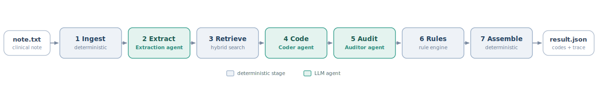
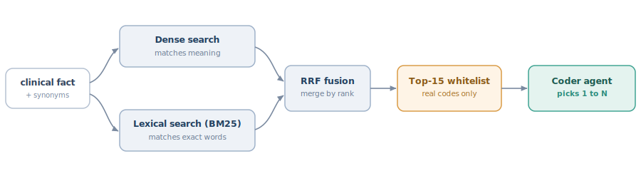

# 1 · Architecture & Data Flow

medcoder converts a free-text clinical note into billable codes (ICD-10-CM, the
US clinical modification of ICD-10, for diagnoses; CPT for procedures) via a
seven-stage pipeline (from `note.txt` to `result.json`) as shown in the diagram
below. Three stages are LLM agents; the other four are plain deterministic code.
Every stage is idempotent and can be rerun on its own, and every stage records
its output to a trace file, so a reviewer can see exactly how each code was
reached.

**Pipeline at a glance**

| # | Stage | Runs on | What it does | Output |
|---|-------|---------|--------------|--------|
| 1 | Ingest | deterministic | normalises text, splits SOAP sections, windows long notes, keeps character offsets | clean, sectioned note |
| 2 | Extract | Extraction agent | pulls clinical facts (verbatim span, normalised term, present/absent/possible, dx/px) | list of facts |
| 3 | Retrieve | deterministic | hybrid search returns a shortlist of real codes per fact (§2) | candidate codes |
| 4 | Code | Coder agent | picks 1 to N codes per fact, only from the shortlist, with a quoted rationale | assigned codes |
| 5 | Audit | Auditor agent | a second, independent model re-checks each (evidence, code) pair | agree / disagree notes |
| 6 | Rules | deterministic | ICD-10-CM guideline checks (conflicts, missing detail, format) | typed warnings |
| 7 | Assemble | deterministic | blends the signals into a confidence tier and writes the result plus its trace | result.json |

**1. Ingest.** Normalises whitespace, segments SOAP sections, windows multi-page
notes with overlap, and preserves global character offsets so every later span
maps back to the source. It also detects the encounter type (inpatient vs
outpatient), which governs whether "probable" or "suspected" diagnoses may be
coded at all (ICD-10-CM Official Guidelines, Section IV.H [1]).

**2. Extract (Extraction agent).** Returns a list of facts: the verbatim span, a
normalised clinical term, the assertion status (present, absent, possible,
hypothetical, family, historical), and the kind (diagnosis, procedure, symptom).
A deterministic NegEx/ConText-style backstop overrules clear polarity mistakes,
so "denies chest pain" is never coded as active chest pain.

**3. Retrieve.** Hybrid search per fact, described in §2.

**4. Code (Coder agent).** Picks 1 to N codes for each fact, only from the
retrieved shortlist, with a stated confidence and a rationale that quotes the
evidence span.

**5. Audit (Auditor agent).** A separate model re-reads each (evidence, code)
pair against the cited text and the code description, and returns agree or
disagree with a short note. To control cost it is selective: only procedures and
low-confidence diagnoses go through the auditor.

**6. Rules.** Deterministic ICD-10-CM checks: Excludes1 conflicts (codes the
guidelines say cannot be reported together), an unspecified code used where a
specific one exists, a missing 7th character on injury or pregnancy codes,
evidence anchoring, and basic format validity. Each issue becomes a typed
warning (missing information, ambiguity, or conflict).

**7. Assemble.** Blends three confidence signals (§3) into a single high, medium,
or low tier and writes a self-contained `outputs/<doc_id>/` folder. Each run
writes one result file (`result.json` by default, `result.md` for a Markdown
review sheet, or `result.annotated.md` for a copy of the note with codes spliced
in at their evidence spans) together with a `trace.json` that records every
stage's output, so a reviewer can reconstruct how each code was reached.

> **Worked example.** The phrase "Type 2 diabetes with diabetic polyneuropathy"
> becomes one fact, retrieves a 15-code shortlist, and the coder selects E11.42
> with that phrase quoted as evidence; the auditor confirms it and the rule
> engine checks the code is billable.

# 2 · Code retrieval / Filtering strategy

**Design:** the coder is constrained to select only from a retrieved candidate
set and can never free-generate a code. For each extracted fact, a short list of
real catalog codes is retrieved; the coder may choose only from that list, and
any code not on it is discarded during validation. Invalid codes are therefore
impossible by construction, which matters because models left to free-generate
ICD-10 produce up to about 35% of codes that are non-billable or do not exist [2].

**How the shortlist is built.** For each fact, two complementary searches are run
over the code descriptions and combined:

- **Dense search** matches by meaning (semantic similarity via cosine), so
  "DM type 2" still finds "type 2 diabetes mellitus". Sentence-transformer
  embeddings are queried over a FAISS index, returning the top 50.
- **Lexical search (BM25)** matches the exact wording, which matters when a
  phrase like "essential hypertension" must be read word for word. It also
  returns the top 50.
- **Reciprocal Rank Fusion** merges the two lists by rank rather than score [3],
  so two very different scoring scales need no calibration. The top 15 fused
  results become the shortlist.

**Query expansion.** Before searching, each fact carries a few synonyms the
extraction agent already produced (for example "MI" expands to "myocardial
infarction"). All are searched and the best result per code is kept, which
widens recall without weakening the shortlist constraint.

**Data:** the real CDC ICD-10-CM FY2027 catalog (about 74,879 codes, US public
domain) is bundled, because a toy catalog would dodge the large-vocabulary
challenge the exercise is really testing. CPT is AMA-copyrighted with no free
tier, so a clearly marked synthetic CPT-shaped catalog is shipped, and a licensed
real-CPT catalog can be substituted through configuration without code changes.

# 3 · LLM usage & Prompting approach

Three role-specialised agents mirror the real coder-then-QA workflow. All of
them go through one LiteLLM gateway, so providers and per-agent models swap with
an environment variable.

| Agent | Human analog | Model (default) | Key constraint |
|-------|--------------|-----------------|----------------|
| Extraction | clinical scribe | `openai/gpt-5.4-mini` | reason first, then emit schema-validated JSON |
| Coder | medical coder | `openai/gpt-5.4-mini` | may only choose codes from the shortlist |
| Auditor | QA reviewer | `anthropic/claude-haiku-4-5-20251001` | a different model family by default |

**Why a different family for the auditor.** Using a different model family for
the check reduces correlated errors and self-preference bias, where a model
rubber-stamps its own answer [4]; a coder-plus-independent-auditor design also
gives the best precision and recall in recent clinical-coding work [5]. A
same-model fallback is supported but flagged as weaker.

**Cost discipline.** The extraction call does triple duty in one shot: it
returns the facts, a note-level encounter type (replacing brittle keyword
counting, §1), and the per-fact synonyms that feed retrieval (§2). Verification
is selective (only procedures and low-confidence diagnoses) and calls are
batched (one extract, one code, one audit per note).

**Prompting choices.**

- *Reason first, then format.* Forcing JSON-only output degrades reasoning
  quality [6], so prompts let the model think internally and then emit one JSON
  object validated against a schema. On a validation failure we retry once with
  the error appended, which is almost always enough.
- *Versioned prompts.* Prompt files are part of the config hash, so any prompt
  change shows up in the audit log.
- *Bounded, pinned sampling.* Models are pinned by dated ID. Temperature 0 is
  used where the provider honours it; GPT-5 reasoning models reject it, so
  determinism instead rests on structured outputs and a low `reasoning_effort`
  setting that is itself part of the config hash.

**Confidence is not the raw LLM number.** A model's stated confidence is
systematically overconfident [7]. We instead blend three signals (the fused
retrieval rank, the coder's discounted confidence, and an auditor adjustment of
+0.15 for agree or -0.30 for disagree) and bin the result into high, medium, or
low tiers using gold-tuned thresholds. Formal calibration is wired as an
extension but needs a larger labelled set than the demo has.

# 4 · Key decisions & trade-offs

| Decision | Why | Trade-off accepted |
|----------|-----|--------------------|
| Retrieve, then constrain (shortlist, not free generation) | Removes invalid codes and turns a 75k-way generation problem into a 15-way choice [8] | Bounded by retriever recall, now measured as a separate stage in the eval |
| Coder plus independent auditor | Best precision and recall on clinical notes [5]; heterogeneous checkers cut correlated errors [4] | Extra LLM calls, reduced by selective and batched verification |
| Hybrid retrieval with RRF | Catches exact terms and paraphrases with no score tuning | Two indexes to build (about a minute on 75k codes) |
| Three fixed agents, no agent swarm | Speculative swarms add latency and silent errors without reliable accuracy gains [9] | Foregoes possible ensemble accuracy for predictability |
| Real ICD-10-CM plus synthetic CPT | Meets the large-vocabulary challenge and stays within AMA licensing | CPT demo runs on synthetic codes |
| LiteLLM gateway | One call for many providers, with a built-in mock for keyless tests | A thin extra dependency |
| Temperature 0 and pinned snapshots | Reproducibility is an explicit requirement | Foregoes a small accuracy gain from sampling |
| Deterministic rule engine | Auditable, exact, and free of LLM cost | Full guideline coverage needs the ICD-10 tabular data and CMS NCCI |
| CLI-first core | Matches the offline brief without over-building | No reviewer UI yet, though the JSON contract supports one |

# 5 · Limitations & extensions

**Limitations (stated honestly).**

- *Assistive, not autonomous.* On the evaluation set the system reaches ICD-10
  micro-F1 about 0.5; full-vocabulary ICD-10 coding is hard in general (reported
  state of the art is around micro-F1 0.54 [10]), so a human reviewer is required
  by design. The output (evidence spans, confidence tiers, editable reviewer
  fields) is shaped to make that review fast.
- *CPT is synthetic.* Real-CPT accuracy must be re-validated on a licensed
  catalog, which can be substituted through configuration without code changes.
- *General-purpose embedder.* A general-purpose embedder (`all-MiniLM-L6-v2`) is
  used by default because it is local, keyless, fast, and adequate for the short
  strings being embedded (code descriptions and extracted terms), where it works
  well alongside BM25. For production clinical text, a domain-specific biomedical
  embedder (SapBERT [11] or PubMedBERT, trained for mention-to-concept linking)
  would improve recall; the embedder is pluggable via configuration.
- *Rule engine is a curated subset.* It covers format, billable status, a short
  Excludes1 list, 7th-character chapters, diagnosis-to-procedure linkage, and
  evidence anchoring; full coverage needs the ICD-10 tabular data and an NCCI
  refresh.
- *Confidence is threshold-tuned, not formally calibrated,* which needs a larger
  labelled set.
- *Evaluation is directional.* A small authored gold set (n=4) is used for
  directional signal only; the contribution is the metric methodology (micro
  precision, recall, and F1; exact-match ratio; hierarchical F1; and per-stage
  retrieval recall), not the absolute scores (ICD-10 micro-F1 about 0.5, CPT
  micro-F1 about 0.8). At n=4 a swing of about 0.05 between runs is normal
  sampling noise, so the committed metrics file is one representative run. A
  larger synthetic set would not add credibility; genuine validation needs a
  licensed labelled corpus such as MIMIC-IV. Precision (about 0.4) is
  over-coding-bound (the coder emits more codes than the gold labels), so the
  main lever is a more selective coder, not retrieval.

**Extensions (designed for, not built).** Several extensions are planned but not
implemented: a Postgres-backed retriever (semantic, full-text, and fuzzy search
in one datastore via pgvector, tsvector, and pg_trgm); domain-specific biomedical
embeddings with a SNOMED-to-ICD crosswalk; a fuller rule engine (the complete
ICD-10 tabular guidelines plus CMS NCCI); a FastAPI service with a reviewer UI;
self-consistency confidence; a licensed real-CPT catalog; and LLM observability
through LiteLLM callbacks. Because every stage is idempotent, the pipeline can
also be orchestrated by a workflow engine such as Airflow or Celery.

# References

[1] ICD-10-CM Official Guidelines for Coding and Reporting, FY2026 (Section IV.H, uncertain diagnoses in the outpatient setting).

[2] NEJM AI, 2024: large language models free-generate large fractions of invalid or non-billable ICD-10 codes.

[3] Cormack, Clarke, and Buettcher, 2009: Reciprocal Rank Fusion outperforms individual rank-learning methods.

[4] arXiv:2410.21819: heterogeneous verifiers reduce correlated errors and self-preference bias.

[5] MDPI Informatics, 2026: a coder-plus-auditor LLM design gives the best precision and recall on MIMIC-IV coding.

[6] arXiv:2408.02442: strict format-only (JSON) constraints degrade LLM reasoning quality.

[7] Xiong et al., 2023: verbalised LLM confidence is systematically overconfident.

[8] arXiv:2407.12849: retrieve-then-rerank constrained coding sharply improves valid-code accuracy.

[9] MAST, NeurIPS 2025: multi-agent "swarm" systems add latency and silent errors without reliable accuracy gains.

[10] RAG-Coding, 2026: state-of-the-art full-vocabulary ICD-10 coding peaks near micro-F1 0.54.

[11] Liu et al., 2021: SapBERT, self-aligned biomedical embeddings for entity (mention-to-concept) linking.
